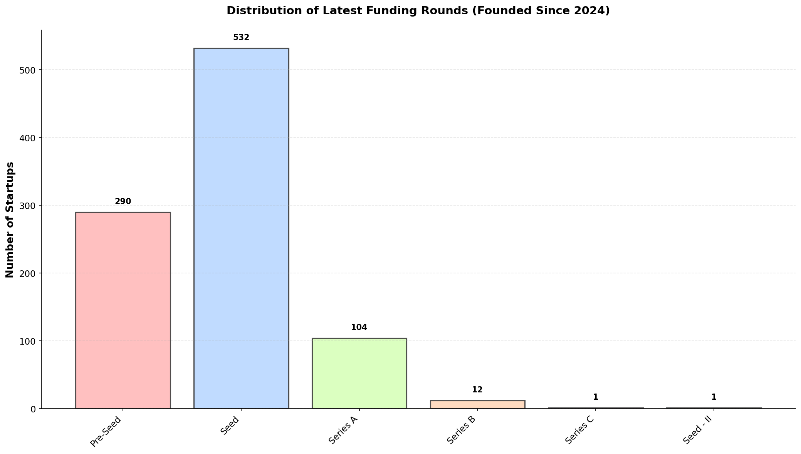
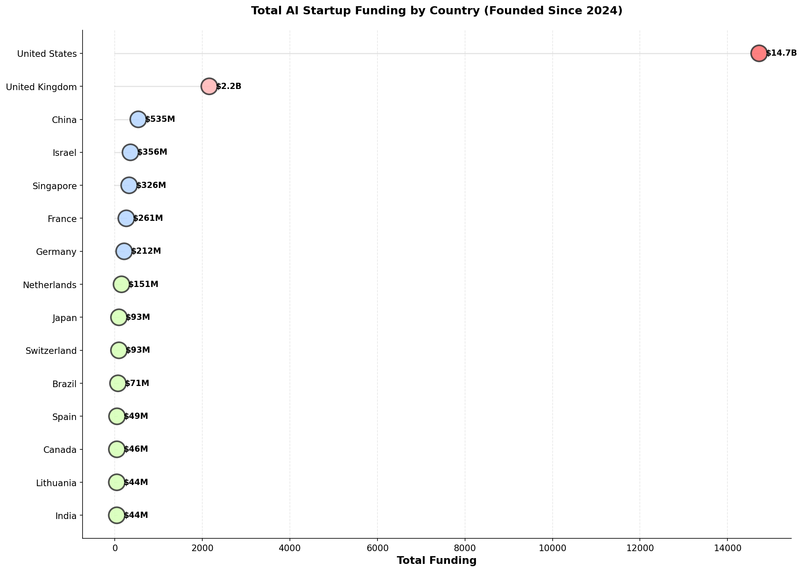
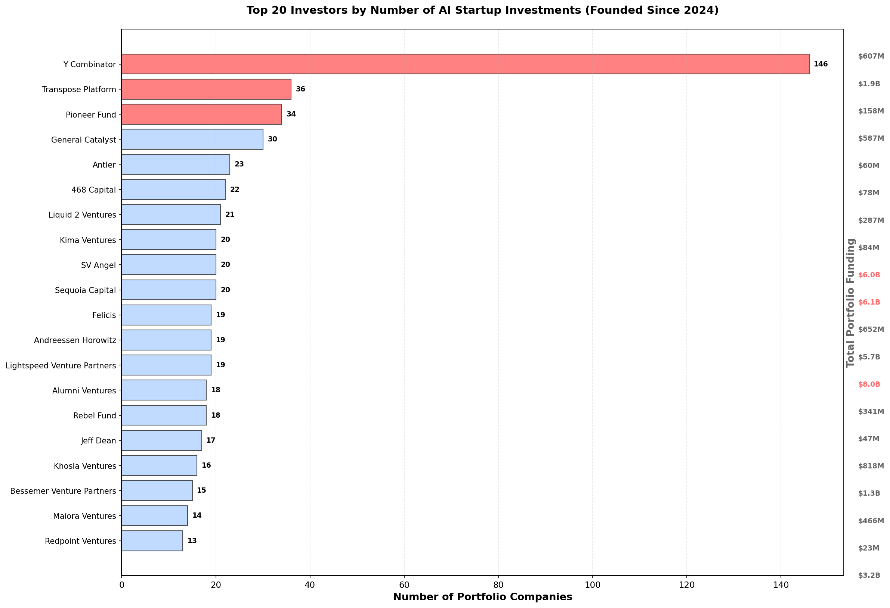
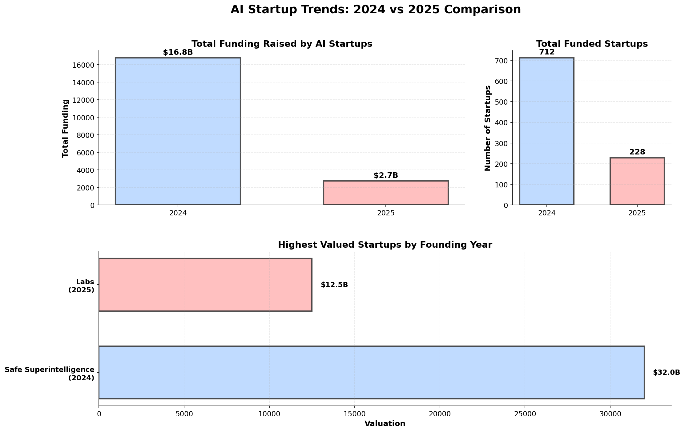
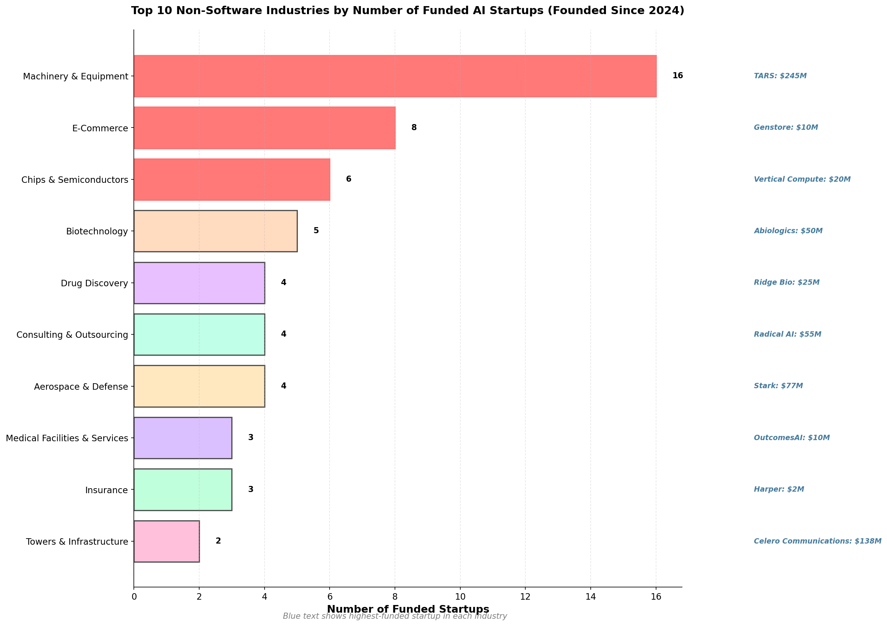

| [home page](https://zenbeam.github.io/shubham-dataviz/) | [data viz examples](dataviz-examples) | [critique by design](critique-by-design) | [final project I](final-project-part-one) | [final project II](final-project-part-two) | [final project III](final-project-part-three) |

# Outline

My project is aimed at analyzing the 940 venture-backed AI/ML startups founded since January 1, 2024 that have raised at least $250,000. The data comes from CB Insights and covers funding patterns, geographic distribution, investor activity, and industry trends through November 2025.

Bay Area companies represent 277 startups, nearly 30% of the total. Y Combinator has backed 146 companies during this period, four times more than any other investor. United States startups have captured $14.7 billion in total funding, representing 76% of global AI investment. Most companies remain at the Seed stage (532 startups), with 104 reaching Series A and 12 blazing-fast startups reaching Series B within their first 18 months.

The project addresses founders deciding where to build, investors evaluating sector trends, and students interested in AI entrepreneurship. By examining 2024 versus 2025 founding cohorts, the analysis captures how investment behavior evolved throughout the post-ChatGPT boom.

The analysis unfolds through six interconnected dimensions that build from geographic patterns to financial outcomes:

**Geographic Distribution:** Bay Area consolidation combines San Francisco, Menlo Park, Palo Alto, and other cities to reveal true regional concentration at 277 startups. Secondary hubs emerge in New York (69), London (39), Paris (25), and Tokyo (18). The visualization hopes to reveal how physical location still matters despite distributed work trends.

**Funding Stage Progression:** After consolidating similar categories, 290 companies sit at Pre-Seed stage (including Angel and Convertible Note rounds), 532 at Seed stage, and 104 at Series A. Only 12 have progressed to Series B. This distribution clearly reflects the compressed timeline from founding to institutional capital in the current AI market -- that we're also still getting used to reading about in news. Pre-Seed consolidates Angel, Convertible Note variants, and all Pre-Seed rounds. Seed combines all Seed and Seed VC variants.

**Global Capital Flows:** The United States leads with $14.7 billion, followed by the United Kingdom at $2.2 billion and China at $535 million. Israel and Singapore round out the top five. The analysis explores how different national ecosystems approach AI investing and whether funding concentration predicts ecosystem strength. The visualization uses dot size to emphasize the gap between US capital deployment and other countries.

**Investor Activity Patterns:** Y Combinator appears in 146 company cap tables, followed by Transpose Platform (36) and Pioneer Fund (34). The visualization displays both investment count and total portfolio funding, revealing whether diversified or concentrated strategies characterize current AI investing. Investors with the highest portfolio funding amounts appear highlighted on both axes to show volume leaders versus capital leaders.

**Year-Over-Year Comparison:** The 2024 cohort includes 712 companies raising $16.8 billion, while 2025 contains 228 companies raising $2.7 billion through November. Safe Superintelligence leads 2024 valuations at $32 billion. Labs tops 2025 at $12.5 billion. The comparison tracks total funding raised, number of funded startups, and highest valuation achieved for each founding year.

**Industry Concentration Beyond Software:** After excluding Internet Software & Services, IT Services, and Mobile Software & Services, the top non-software industry is Machinery & Equipment with 16 startups. The visualization pairs each industry with its highest-funded company to reveal capital concentration patterns within verticals. This analysis shows where AI applications extend beyond pure software plays into manufacturing, healthcare devices, and physical infrastructure.

The story moves from geography to finance to industry concentration. Geographic context establishes where startups cluster. Funding stages reveal investor confidence levels. Country-level capital flows demonstrate ecosystem efficiency. Investor patterns highlight institutional strategies. Year-over-year comparison shows market evolution. Industry analysis identifies sector diversification beyond software.

## Initial sketches

### Sketch 1: Geographic Distribution of Funded Startups

This horizontal bar chart shows the top 15 cities by startup count using distinct pastel colors for visual clarity. Bay Area appears in red at 277 startups after consolidating San Francisco, Menlo Park, Palo Alto, Mountain View, Stanford, Berkeley, San Mateo, Sunnyvale, Redwood City, and Santa Clara. New York follows with 69, then London with 39. The color palette ensures adjacent cities remain visually distinct to prevent reader confusion. 

Note: I hope to learn, experiment, and try a more creative map-like chart for this use-case in the final project.

### Sketch 2: Distribution of Latest Funding Rounds

This bar chart displays funding stage distribution after consolidation. Pre-Seed combines Pre-Seed variants, Angel rounds, and Convertible Note rounds for 290 companies total. Seed consolidates all Seed and Seed VC variants for 532 companies. Series A combines Series A and Series A-II for 98 companies. Only one company has reached Series C. The pastel color gradient helps viewers track progression from early to late-stage rounds while emphasizing how recently these companies were founded.

### Sketch 3: Global Capital Flows by Country

This dot plot uses circle size and color intensity to represent total funding by country. The United States appears in red with $14.7B, dramatically outpacing other countries. United Kingdom shows $2.2B, China has $535M. Lines connecting the y-axis to each dot create visual emphasis on the funding gap. Red dots indicate amounts exceeding $10 billion, pink for $1-10 billion, blue for $200M-$1B, green for under $200M. The visualization converts amounts over $1 billion to B notation for readability.

Note: I hope to learn, experiment, and try a more creative map-like chart for this use-case in the final project.

### Sketch 4: Top Investors by Activity and Capital

This horizontal bar chart ranks the top 20 investors by portfolio company count. Y Combinator leads with 146 investments, shown in red. The left axis displays investment count while funding amounts appear on the right side. Top investors by portfolio funding amount (not just count) appear highlighted in red on the right axis as well, showing which investors deploy the most total capital. Transpose Platform ranks second with 36 investments, Pioneer Fund third with 34. The dual highlighting reveals both volume investors and capital-heavy investors.

### Sketch 5: Comparing 2024 and 2025 Founding Cohorts

This multi-panel layout tracks three metrics across founding years using pastel blue for 2024 and pastel pink for 2025. Total funding shows 2024 companies raised $16.8B versus $2.7B for 2025 companies. Startup counts display 712 in 2024 versus 228 in 2025. The bottom panel compares highest valuations: Safe Superintelligence (2024) at $32.0B versus Labs (2025) at $12.5B. All amounts exceeding $1 billion display in B notation for easier reading.

### Sketch 6: Industry Concentration Beyond Software

This horizontal bar chart shows the top 10 non-software industries by startup count after excluding Internet Software & Services, IT Services, and Mobile Software & Services. Machinery & Equipment leads with 16 companies. Each bar includes the industry's highest-funded company in blue text with funding amount in billions where applicable. The top three industries appear in red to emphasize concentration. The visualization reveals where AI applications extend into hardware, manufacturing, and physical infrastructure.

# The data

The dataset originates from CB Insights, extracted in November 2025 with these filters: AI/ML industry classification, founded January 1, 2024 or later, minimum $250,000 total funding. The export contains 940 companies across 21 data fields including company name, geography, funding metrics, investor lists, valuations, and revenue data.

CB Insights aggregates information from SEC filings, press releases, company announcements, and proprietary deal tracking. Each funding round undergoes verification through multiple sources. The platform specializes in private company data where public information remains scarce.

For geographic analysis, Bay Area cities (San Francisco, Menlo Park, Palo Alto, Mountain View, Stanford, Berkeley, San Mateo, Sunnyvale, Redwood City, Santa Clara) merge into a single region. Bangalore and Bengaluru combine since they refer to the same city.

For funding stage analysis, related categories group together. Pre-Seed includes Angel, Convertible Note variants, and all Pre-Seed rounds. Seed consolidates Seed, Seed 2, and all Seed VC variants. Series A combines Series A and Series A-II. This consolidation produces cleaner visualizations while maintaining analytical accuracy.

For investor analysis, the comma-separated "All Investors" field gets parsed to count individual investor appearances across companies. Each investor tallies separately, then ranks by frequency. Total funding amounts sum for companies in each investor's portfolio.

Missing values appear throughout the dataset. Of 940 companies, 7 lack total funding amounts, 53 lack city data, 276 lack state data (primarily international), 821 lack valuation data (only 119 report valuations) -- thus we don't use this datapoint in our visualizations. Visualizations requiring specific fields exclude companies with missing data in those fields only. Geographic analysis uses Country when City is unavailable. 

The data captures reported funding only. Stealth companies may have raised capital without disclosure. Angel rounds under $250,000 fall outside the minimum threshold by design. Reported valuations reflect the most recent disclosed round rather than current market value.

| Name | URL | Description |
|------|-----|-------------|
| CB Insights AI/ML Companies Dataset | [GitHub Repository](https://github.com/zenbeam/shubham-dataviz/Venture_Backed_AI_Companies_Founded_Since_2024.csv) | Complete dataset of 940 venture-backed AI startups founded since January 1, 2024 with minimum $250K funding. Includes company name, location, funding details, investor lists, valuations, and industry classifications. |

# Method and medium

The final project will use Tableau Public for interactive visualizations and Shorthand for narrative presentation.

Tableau Public handles all data visualization work. The CSV will be imported seamlessly and calculated fields handle geographic consolidation and investor parsing, and dashboards build for each analytical dimension. Each visualization includes hover-over functionality showing additional company details like funding amounts, investor lists, and descriptions. Tableau's embedding capabilities allow interactive elements to function natively within Shorthand rather than as static images.

I will be using Shorthand since the storytelling framework the platform's scrolling interface will work excellently to tell the story I'm envisioning and this project structure and allowing readers to encounter each visualization as they progress through the analysis. Full-width image sections can highlight key visualizations, and I intend to play with contrasting colors in different sections. Reveal animations can introduce each new section and mobile responsiveness works automatically across devices.

The final deliverable will be a public Shorthand URL accessible without login requirements. The story will take approximately 10-12 minutes to read, including six interactive Tableau visualizations, narrative text for each section, and synthesis bringing together findings across all dimensions. External links connect to notable companies and investors mentioned throughout.

## References

CB Insights. (2025). *AI/ML Companies Founded Since January 2024*. Market Intelligence Platform. Retrieved November 2025.

Berinato, S. (2016). *Good Charts: The HBR Guide to Making Smarter, More Persuasive Data Visualizations*. Harvard Business Review Press.

## AI acknowledgements

This project used Copilot to assist with Python code generation for data processing and visualization creation. All data analysis decisions, visualization design choices, narrative structure, and written content reflect original analytical work. AI assistance focused on technical implementation and debugging rather than analytical direction or content creation.
