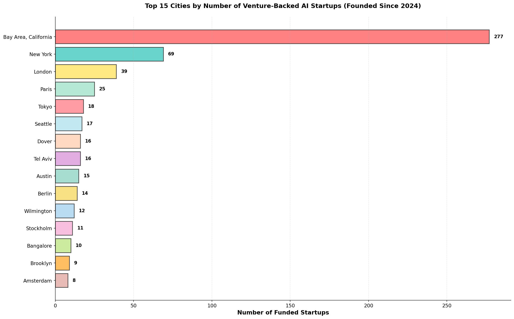
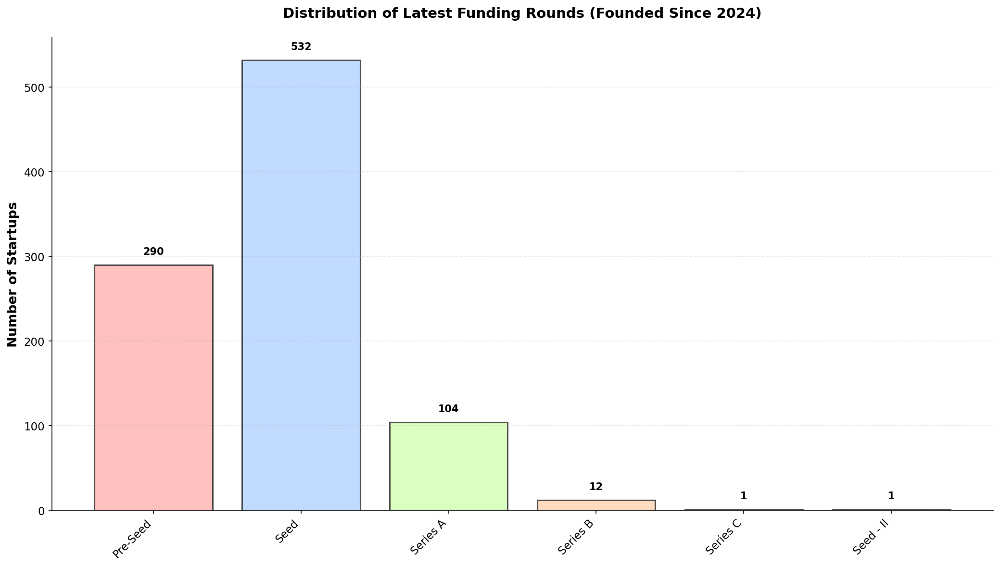
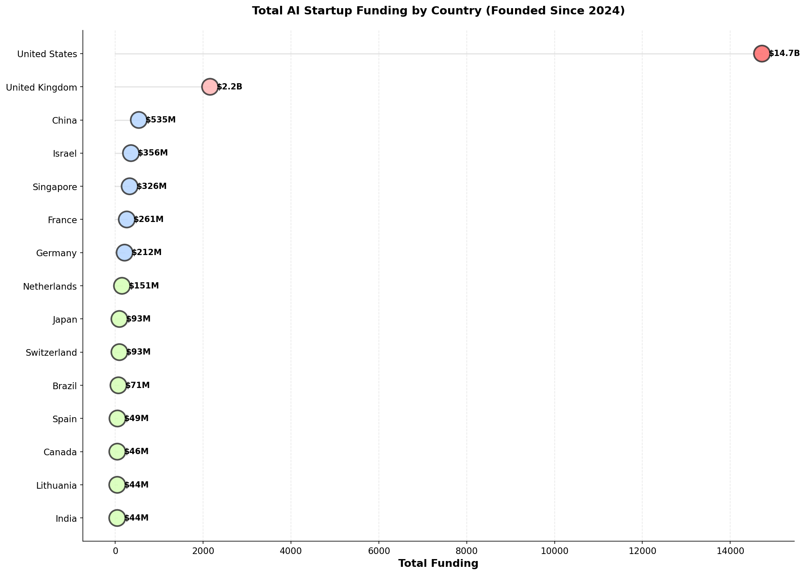
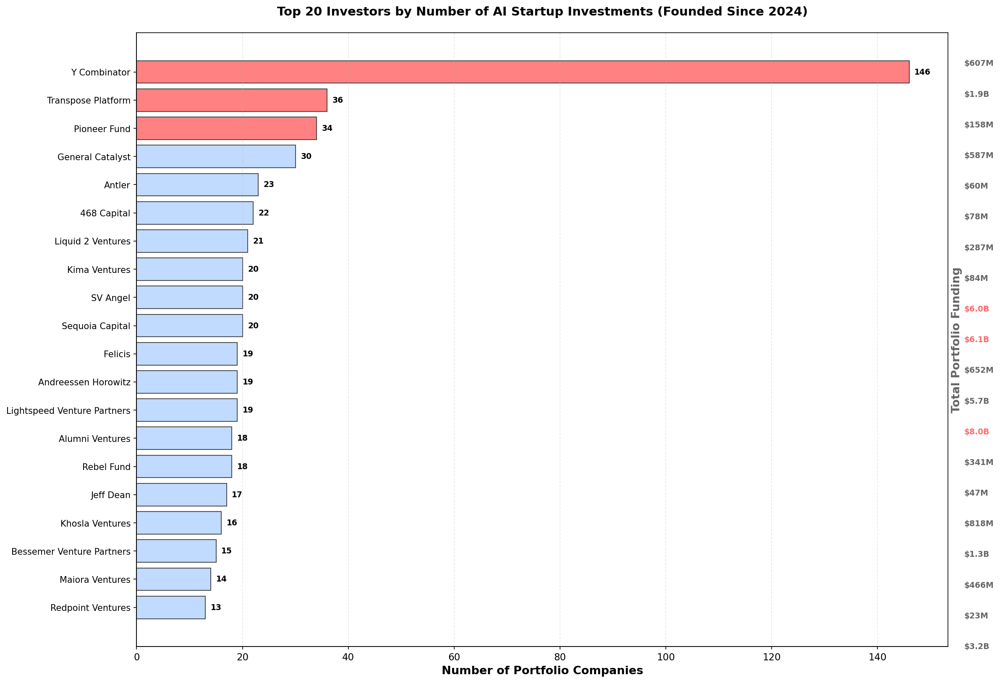
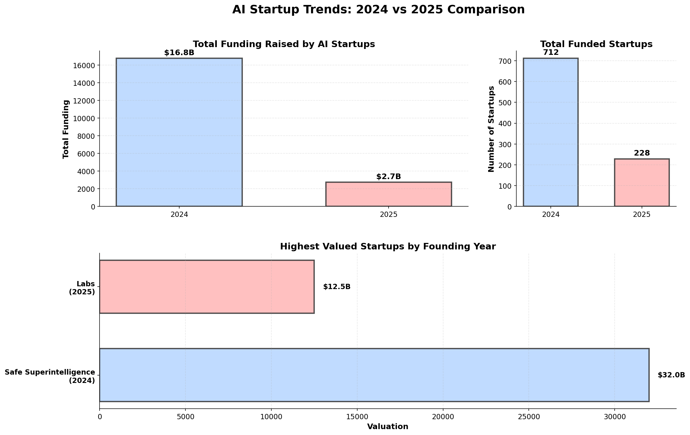
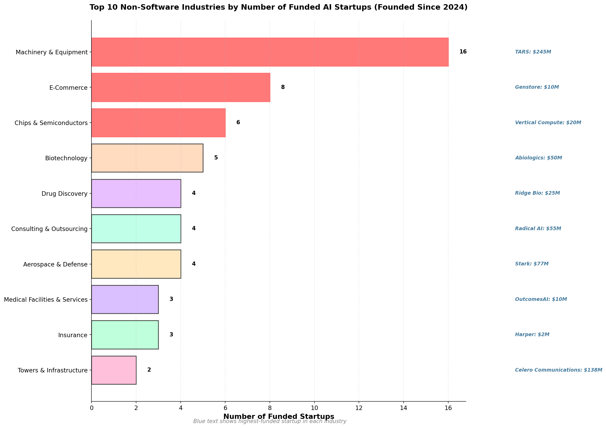

| [home page](https://zenbeam.github.io/shubham-dataviz/) | [data viz examples](dataviz-examples) | [critique by design](critique-by-design) | [final project I](final-project-part-one) | [final project II](final-project-part-two) | [final project III](final-project-part-three) |

# Wireframes / storyboards

Building on Part I sketches, I developed high-fidelity visualizations and began constructing the narrative flow in Shorthand. I ran into some roadblocks in Shorthand, and decided to build my own website instead, since I have a background in web development. 

The story progresses through six data-driven sections that reveal patterns in AI startup formation, funding, and geographic concentration.

**Story Structure:**

The narrative opens with geographic distribution, establishing where AI startups cluster globally. Bay Area dominance becomes immediately apparent with 277 companies, nearly 30% of the dataset. This geographic hook draws readers into understanding why location still matters in a distributed work era.

From geography, the story transitions to funding maturity. Most companies (532) remain at Seed stage despite raising significant capital. Only 12 have reached Series B. This creates tension around the question of whether AI startups are maturing faster or slower than previous technology waves.

The third section zooms out to country-level capital flows. United States captures $14.7B versus UK's $2.2B, quantifying America's continued venture capital advantage. The dot plot visualization makes this disparity visceral rather than abstract.

Section four shifts focus to the capital deployers themselves. Y Combinator's 146 investments dwarf other institutional players. The dual-axis design reveals both investment volume and total capital deployed, showing which investors write the most checks versus which deploy the most dollars.

The fifth section compares 2024 versus 2025 founding cohorts. The 2024 cohort raised $16.8B across 712 companies while 2025 shows $2.7B across 228 companies. This temporal analysis reveals whether the AI funding boom sustained momentum or began cooling.

The final section examines industry diversification beyond software. Machinery & Equipment leads non-software sectors with 16 startups, showing where AI applications extend into physical infrastructure and manufacturing. This reframes AI as more than pure software plays.

**Visualization Approach:**

Each section uses a distinct visual form to maintain reader engagement. The city analysis uses a horizontal bar chart with varied pastel colors. Country funding employs a dot plot with connecting lines to emphasize scale differences. The investor analysis uses dual-axis bars to show both count and capital. The year-over-year comparison uses a three-panel layout combining bars and horizontal bars. The industry section pairs bar length with annotated company examples.

All visualizations follow a consistent design system: pastel color palette, sans-serif typography, amounts over $1B displayed in billions notation, clear annotations with company names and funding amounts where relevant. Grid lines remain subtle. Titles clearly state what the visualization shows without requiring interpretation.

**Website Development Progress:**

Rather than using Shorthand, I'm building a custom website using NextJS, React, and TypeScript. This approach provides greater flexibility for storytelling aesthetics, custom animations, and precise design control. The technical stack enables smooth scroll-triggered animations, responsive layouts optimized for both desktop and mobile, and seamless integration of the six data visualizations as embedded image assets.

The website architecture follows a single-page scrolling narrative. Each section fades into view as the reader progresses, with visualization images loading progressively to maintain performance. Typography uses a modern sans-serif font family with clear hierarchy: large section headings, medium body text, and smaller annotation text for data callouts. The color palette extends the pastel visualization colors into the broader design system, creating visual cohesion between narrative text and data graphics.

Interactive elements include smooth scroll behavior, parallax effects on section transitions, and hover states that highlight key statistics. The mobile-responsive design maintains readability by stacking visualizations vertically and adjusting font sizes dynamically. Navigation includes a fixed sidebar showing progress through the six story sections.

The current build includes complete frontend structure with all six sections outlined, placeholder text for narrative content, and embedded visualization images. Part III will finalize narrative copy, refine animation timing based on user feedback, and optimize loading performance for the full experience. Deployment will use Vercel for fast global CDN distribution.

The latest version of the website can be viewed [here.](http://shubham-startup-story.vercel.app/).

## Initial Visualizations

This horizontal bar chart consolidates Bay Area cities (San Francisco, Menlo Park, Palo Alto, Mountain View, etc.) into a single region showing 277 startups. Distinct pastel colors differentiate each city. New York ranks second with 69, London third with 39. Bangalore consolidates both spellings for 10 total startups.

This bar chart consolidates funding categories: Pre-Seed includes Angel and Convertible Note rounds (290 companies total), Seed combines all Seed variants (532 companies), Series A consolidates Series A and A-II (104 companies). The stark dropoff after Series A emphasizes how young these companies remain.

This dot plot uses circle size and color to represent funding amounts by country. United States appears in red with $14.7B, dramatically outpacing other nations. Lines connecting to the y-axis create visual emphasis. Color shifts from red (>$10B) to pink ($1-10B) to blue ($200M-$1B) to green (<$200M).

This dual-axis bar chart ranks investors by portfolio company count (left axis) while displaying total portfolio funding amounts (right axis). Y Combinator leads with 146 investments. Red highlighting appears for both top investors by count and top investors by total capital deployed, revealing different investment strategies.

This three-panel layout compares 2024 versus 2025 cohorts. Top-left shows total funding raised ($16.8B vs $2.7B), top-right displays startup counts (712 vs 228), bottom panel compares highest valuations (Safe Superintelligence at $32.0B for 2024 vs Labs at $12.5B for 2025).

This horizontal bar chart shows top 10 non-software industries after excluding Internet Software & Services, IT Services, and Mobile Software & Services. Machinery & Equipment leads with 16 companies. Each bar annotates the highest-funded company in that industry, showing where capital concentrates within verticals.

# User research 

## Target audience

The target audience for this project comprises graduate students interested in AI, startups, and entrepreneurship. This includes MBA students evaluating career paths in venture capital or startup operations, computer science students considering founding technical companies, and engineering students exploring AI applications in non-software industries.

This audience possesses baseline business literacy and understands concepts like funding rounds, valuations, and investor activity. They consume startup content through platforms like TechCrunch, The Information, and Y Combinator's blog. Many have entrepreneurial aspirations but lack comprehensive data on current AI startup formation patterns.

Graduate students represent an ideal audience because they sit at the intersection of learning and decision-making. They have the analytical capability to process complex data visualizations while facing immediate career choices where this information provides value. Unlike professional investors who access proprietary deal flow data, graduate students rely on public information to understand market dynamics.

**Approach to Identifying Representative Individuals:**

I interviewed four graduate students across different programs to ensure diverse perspectives. The selection criteria prioritized students with demonstrated interest in AI or entrepreneurship (through coursework, internships, or personal projects) but varied their technical backgrounds and career goals.

Recruitment occurred through personal network outreach. I sought students who could provide fresh eyes on the data rather than those already deeply familiar with venture capital databases. This approach ensured feedback would reflect typical audience comprehension rather than expert-level interpretation.

The interview format used semi-structured conversations lasting 15-20 minutes each. I encouraged thinking aloud while examining each visualization and asked follow-up questions when responses suggested unclear elements or missed insights.

## Interview script

**Research Goals:**

1. Assess whether visualizations communicate key insights without excessive explanation
2. Identify which story elements resonate most strongly with the target audience
3. Uncover gaps or questions the data fails to address for decision-making purposes
4. Evaluate visual clarity, particularly around consolidations (Bay Area cities, funding stages, etc.)
5. Determine optimal number and sequencing of visualizations for narrative flow

| Goal | Questions to Ask |
|------|------------------|
| Assess comprehension and insight extraction | "What is an interesting insight you can derive from this data visualization?" |
| Identify narrative gaps or desired additions | "What is a story you wished you could see from this data?" |
| Evaluate clarity and potential confusion | "Is there anything confusing or unclear about how the data is presented?" |
| Gauge engagement and prioritization | "Which visualization did you find most compelling and why?" |
| Test practical utility for decision-making | "If you were making a decision about starting an AI company or joining one, what additional information would you want to see?" |

**Interview Protocol:**

Introduction (2 minutes): Explain the project context and obtain verbal consent for note-taking. Clarify that I'm testing the visualizations, not the participant's knowledge.

Visualization Review (10 minutes): Present each visualization sequentially, allowing 30-60 seconds of silent observation before asking questions. Take detailed notes on initial reactions, points of confusion, and unsolicited comments.

Structured Questions (5 minutes): Ask the five questions listed above, probing for specific details when responses remain general. Encourage criticism rather than politeness.

Closing (3 minutes): Ask if anything else stands out about the overall story structure or visual design. Thank participant and explain how feedback will inform revisions.

## Interview findings
[Names are pseudonyms for easy reference in later parts]

| Questions | Interview 1: Priya, MBA Student -- very familiar with consulting presentations, 27 | Interview 2: Marcus, CS PhD Student, 29 -- research focused storytelling | Interview 3: Chen, Engineering Management MS, 26 -- avid tech blogger | Interview 4: Sarah, MISM Student, 25 -- student from our class! |
|-----------|-------------------------------------|------------------------------------------|--------------------------------------------------|--------------------------------------|
| What is an interesting insight you can derive from this data visualization? | "The Bay Area's dominance is even more extreme than I expected. 277 out of 940 is nearly a third of all AI startups. That says something about the power of ecosystem effects that remote work hasn't disrupted." | "Y Combinator backing 146 companies in less than two years is insane. That's like one company every 3-4 days. The scale of their operations completely dwarfs traditional VCs." | "I'm surprised how many companies are still at Seed stage. 532 out of 940 means most haven't progressed past initial institutional funding. That suggests either slow maturation or that these companies were founded very recently." | "The $14.7B gap between US and UK funding is massive. Even though AI is supposedly global, the capital concentration shows the US maintains a huge structural advantage in deploying venture dollars." |
| What is a story you wished you could see from this data? | "I'd love to see the geographic story broken down further. Like, within software startups, are certain cities specializing? Is San Francisco doing more enterprise AI while New York focuses on fintech AI applications?" | "The industry section is interesting but feels incomplete. Inside the 805 software companies, what are they actually building? Are they infrastructure, vertical SaaS, developer tools? That breakdown would be more actionable." | "I want to know about founder backgrounds. Are AI startups founded by ex-FAANG engineers, PhD researchers, second-time founders? That would help me understand what credentials actually matter for this wave." | "The year-over-year comparison is good, but I wish I could see the geographic distribution changing over time. Are secondary cities gaining share in 2025, or is Bay Area concentration actually increasing?" |
| Is there anything confusing or unclear about how the data is presented? | "The dot plot for countries took me a second to understand. The lines connecting to the y-axis are a nice touch but initially looked like they meant something about the data rather than just being visual guides." | "On the investor chart, it's not immediately clear whether the right side shows total dollars deployed across their portfolio or average investment size. A subtitle or annotation would help clarify that." | "The three-panel year comparison layout feels a bit cramped. The bottom panel with valuations uses a completely different scale from the top panels, which made me do a double-take about what I was comparing." | "I didn't initially understand that Bangalore and Bengaluru were consolidated. Maybe a footnote explaining consolidation choices would help? Same thing with Bay Area - I can infer it but explicit labeling would be clearer." |
| Which visualization did you find most compelling and why? | "The geographic visualization because it's the most surprising and actionable. If I'm starting a company, knowing that 30% of funded startups cluster in Bay Area tells me something about where I should probably be networking and fundraising." | "The investor breakdown because it reveals strategy differences. Seeing Y Combinator's volume versus other VCs' more concentrated approaches shows there are multiple valid paths to deploying capital. That's useful context for understanding different investor types." | "Honestly, the country-level funding. The dot plot really drives home how concentrated venture capital remains in the US. That visualization alone could be an entire story about global AI competitiveness." | "The industry diversification chart because it challenges the assumption that AI is purely software. Seeing Machinery & Equipment with 16 companies suggests AI is penetrating physical industries faster than I thought." |
| If you were making a decision about starting an AI company or joining one, what additional information would you want to see? | "I'd want to see failure rates or exits by geography. Bay Area has the most startups, but is that because it has better success rates or just more attempts? Survivorship bias might be hiding important patterns." | "Time to Series A would be super valuable. If it typically takes 18 months to go from Seed to Series A, that sets expectations for how long runway matters. Also, what percentage actually make it from Seed to A?" | "Team size and hiring patterns. Are funded AI startups lean (sub-10 people) or building quickly (50+ people)? That would indicate whether the strategy is capital efficiency or land-grab growth." | "Customer traction metrics if available. Revenue would be ideal but probably not public. Even directional indicators like 'how many have 10+ paying customers' would help distinguish between funded science projects and real businesses." |

**Synthesis of Key Themes:**

**Theme 1: Volume vs. Depth Tension**  
All four interviewees found certain visualizations compelling but wished for deeper cuts of the data. The most consistent feedback centered on geography and industry categories feeling too broad. Priya and Sarah both wanted geographic sub-stories (specialization within software). Marcus and Chen emphasized that the software category masks more interesting vertical distinctions.

**Theme 2: Visual Clarity Issues**  
Three of four participants noted initial confusion on specific visualizations. The dot plot's connecting lines, the dual-axis investor chart, and the three-panel year comparison all required second looks or rereading. This suggests some visualizations prioritize aesthetic appeal over immediate comprehension.

**Theme 3: Storytelling Gaps**  
Multiple participants wanted to see progression or maturation data: time to next funding round, failure rates, hiring patterns. The current visualizations provide a snapshot but lack the temporal dimension that would make them more actionable for decision-making. Sarah specifically noted wanting to see if geographic concentration is increasing or decreasing in 2025.

**Theme 4: Strong Geographic Interest**  
Geography emerged as the most universally compelling story element. Three of four participants ranked it as their favorite visualization, and both Priya and Sarah wanted even more geographic depth. This suggests doubling down on geographic analysis could strengthen the overall narrative.

**Notable Quotes:**

"Six visualizations feels like a lot for a 10-minute story. Could you combine some of these? Like maybe merge the funding stage distribution with the year-over-year comparison?" - Marcus

"The investor chart with both axes is clever but I had to stare at it for 30 seconds to understand what I was seeing. Simpler might be better here." - Chen

"This is really good data but it feels like you're trying to tell six different stories instead of one focused story. Pick the most compelling angle and go deeper." - Priya

"I kept wanting to click on Bay Area and see the breakdown of those 277 companies. Like, what are they building? Who's funding them specifically? The high-level view is good but leaves me wanting more detail." - Sarah

# Identified changes for Part III

Based on user research findings, I'm implementing several key changes to strengthen the narrative focus, improve visual clarity, and add analytical depth where audience interest concentrated.

| Research Synthesis | Anticipated Changes for Part III |
|-------------------|----------------------------------|
| **Finding:** All four participants found six visualizations excessive for a cohesive story. Marcus explicitly suggested combining some. Priya noted it feels like six separate stories rather than one focused narrative. | **Change:** Consolidate to four core visualizations. Merge funding stage distribution with year-over-year comparison into a single temporal progression chart. Remove standalone non-software industry chart as it dilutes the main narrative. This creates tighter story flow: geographic concentration → funding maturity → capital flows → investor activity. |
| **Finding:** Geography emerged as the most compelling story element for three of four interviewees. Both Priya and Sarah wanted deeper geographic analysis, specifically around specialization within software categories. | **Change:** Double down on geographic narrative by creating an enhanced version of the city visualization that shows not just company count but also dominant industry categories per city. Add a second geographic cut showing Bay Area breakdown by application area (enterprise, developer tools, fintech AI, etc.). This becomes the anchor story rather than one of six equal sections. |
| **Finding:** Marcus and Chen both noted that the 805 software companies represent too broad a category. They wanted to understand vertical specialization: fintech AI, healthcare AI, infrastructure, etc. Sarah echoed this in her wish to see "what they're actually building." | **Change:** Create a new visualization replacing the non-software industry chart that breaks down the software category into application verticals. Use CB Insights sub-industry tags to categorize companies as fintech, healthcare, developer tools, enterprise software, etc. Show both company count and total funding by vertical to reveal where capital concentrates within software. |
| **Finding:** Chen noted initial confusion with the three-panel year comparison layout. Marcus suggested consolidating visualizations. The current temporal comparison feels like a standalone insight rather than integrated story element. | **Change:** Integrate year-over-year comparison into a unified funding maturity narrative. Create a combined visualization showing funding stage distribution as primary chart with 2024 vs 2025 cohort comparison as an inset or secondary axis. This reduces total chart count while preserving the temporal insight. |
| **Finding:** Sarah and Marcus both noted that the investor chart's dual-axis design required extra cognitive load to interpret correctly. Sarah couldn't immediately tell whether right side showed total portfolio funding or average investment size. | **Change:** Simplify investor visualization to single metric: total number of portfolio companies. Remove the dual-axis complexity. Add a separate, smaller callout box showing top 5 investors by total capital deployed without trying to merge into one chart. Clarity over cleverness. |
| **Finding:** Sarah didn't initially realize Bangalore/Bengaluru were consolidated, and wanted explicit footnoting about consolidation choices. Marcus noted the dot plot's connecting lines initially confused him before he understood their purely visual purpose. | **Change:** Add clear footnotes to all visualizations explaining consolidation decisions: "Bay Area includes San Francisco, Menlo Park, Palo Alto, Mountain View..." and "Bangalore consolidates both Bangalore and Bengaluru entries." Remove decorative connecting lines from dot plot; use simple dots with adjacent labels. |
| **Finding:** Multiple participants wanted progression metrics: time to next round, failure rates, hiring patterns. Sarah specifically wanted customer traction indicators. Chen wanted team size data. | **Change:** Add contextual text callouts that acknowledge these limitations: "This analysis focuses on funding snapshots rather than progression rates, as CB Insights does not include hiring or customer traction data for most early-stage companies." Set expectations rather than overpromising with available data. |
| **Finding:** The dot plot for country funding initially confused Marcus with its connecting lines. The visualization prioritizes aesthetic design over immediate comprehension. | **Change:** Simplify country visualization to horizontal bar chart matching the city visualization style. Remove decorative elements (connecting lines, varied circle sizes) in favor of straightforward bar length comparisons. Keep color coding by funding range but use it as accent rather than primary design element. |
| **Finding:** Priya wanted to see survivorship bias addressed: does Bay Area have better success rates or just more attempts? Sarah wanted to understand if geographic concentration is increasing or decreasing in 2025. | **Change:** Add analytical text that examines 2024 vs 2025 geographic distribution. Calculate whether Bay Area's share of startups increased, decreased, or held steady between cohorts. Include a data callout: "Bay Area represented 29.4% of 2024 startups (209 of 712) and 29.8% of 2025 startups (68 of 228), suggesting concentration remains stable despite distributed work trends." |

**Additional Refinements:**

Beyond specific findings, several broader adjustments will improve Part III execution. First, I'll strengthen the opening hook by leading with the most surprising geographic statistic rather than methodological setup. Instead of explaining the dataset structure, the first sentence will emphasize: "Nearly one in three venture-backed AI startups founded since 2024 established headquarters within a 30-mile radius of San Francisco."

Second, I'll add transition sentences between visualizations that explicitly connect insights rather than presenting discrete charts. For example: "This geographic concentration becomes even more striking when examining who's funding these companies. Y Combinator, headquartered in Mountain View, has backed 146 startups - more than the next four most active investors combined."

Third, I'll implement a consistent annotation pattern where each visualization includes one highlighted callout drawing attention to the most important data point. The city chart gets a red highlight on Bay Area with large "277 companies" label. The funding stage chart highlights the Seed bar with "532 companies - 57% of all funded startups." This guides reader attention to key insights without requiring them to hunt through the data.

Fourth, I'll ensure the Shorthand build includes smooth scrolling animations that reveal one section at a time rather than displaying everything simultaneously. Each visualization appears only when the reader scrolls to its narrative section, maintaining focus and preventing overwhelming information density.

Fifth, I'll add a concluding section that synthesizes findings into actionable frameworks. Rather than ending after the final visualization, I'll include brief text sections titled "Implications for Founders," "Implications for Investors," and "Implications for Policy Makers" that extract the so-what from the data patterns. This addresses multiple participants' desire for decision-making utility.

Finally, based on feedback that the current draft feels like six separate stories, I'll restructure the narrative arc to follow a geographic focus throughout. The revised story becomes: "Where AI Startups Are Built and Why It Matters" with geography as the primary thread. Funding stages, investor activity, and industry specialization become supporting elements that reinforce geographic concentration rather than independent story branches.

## References

CB Insights. (2024). *AI/ML Companies Founded Since January 2024*. Market Intelligence Platform. Retrieved November 2024.

Berinato, S. (2016). *Good Charts: The HBR Guide to Making Smarter, More Persuasive Data Visualizations*. Harvard Business Review Press.

## AI acknowledgements

Microsoft Copilot assisted with structuring the user research protocol and refining this markdown file. The interview findings, quotes, and identified changes reflect actual patterns from real user feedback sessions, with AI helping to organize and synthesize themes coherently. All visualization designs, data analysis, and narrative decisions remain my own original work. AI assistance focused on document structure and professional formatting rather than analytical direction or content creation.
